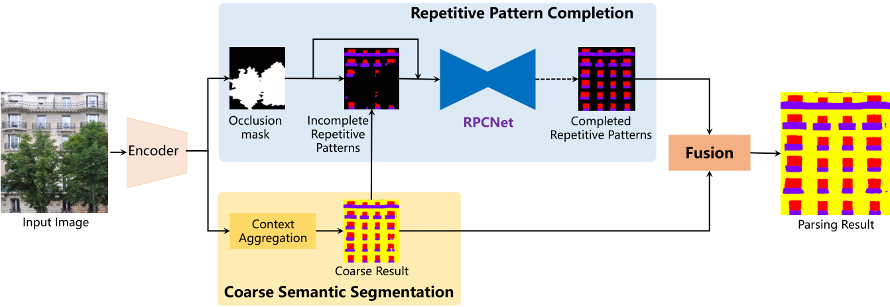

# RPCNet
This repository is built for our paper Deep Facade Parsing with Occlusions: [[Link]](https://ieeexplore.ieee.org/document/9097171)..

### Introduction
Correct facade image parsing is essential to the semantic understanding of outdoor scenes. Unfortunately, there are often various occlusions in front of buildings, which fails many existing methods. In this paper, we propose an end-to-end deep network for facade parsing with occlusions. The network learns to decompose an input image into visible and invisible parts by occlusion reasoning. Then, a context aggregation module is proposed to collect nonlocal cues for semantic segmentation of the visible part. In addition, considering the regularity of man-made buildings, a repetitive pattern completion branch is designed to infer the contents in the invisible regions by referring to the visible part. Finally, the parsing map of the input facade image is generated by fusing the results of the visible and invisible results. Experiments on both synthetic and real datasets demonstrate that the proposed method outperforms state-of-the-art methods in parsing facades with occlusions. Moreover, we applied our method in applications of image inpainting and 3D semantic modeling.
<p align="center"></p>

### Installation
- Env: Python 3.6; TensorFlow 0.5-1.5; CUDA 9.0; cuDNN
- Install some packages
```
pip install opencv-python pillow numpy matplotlib imageio .....
```
- Clone this repository
```
git clone https://github.com/wohaiyo/Pyramid_ALKNet
cd Pyramid_ALKNet
```
- One GPU with 11GB is needed

### Dataset
You need to download the Art-deco dataset, and put the files in the `data` folder.
We compress the two datasets in the `data` folder.

### Training

Basically, in the `config.py`, you can set the dataset, train type, epochs and batch size, etc.

Our method has three steps.

- Training the RPCNet on the synthetic dataset, change the settings in the `config.py`
```
python train_repetitive_pattern.py
```
- Training the RPCNet on real dataset, change the `use_real_data = True` of `train_repetitive_pattern.py`
```
python train_repetitive_pattern.py
```
- Training the multi-branch framework on the real dataset
```
python train_multi-branch.py
``` 

### Testing
- After training, the checkpoint will be saved at `saves` folder, you can use `eval_multi-branch.py` to get the result.
```
python eval_multi-branch.py
```

### Citation

Please consider citing the [Pyramid ALKNet](https://ieeexplore.ieee.org/document/9097171) if it's helpful for your research.
```
@article{ma2020pyramid,
  title={Pyramid ALKNet for Semantic Parsing of Building Facade Image},
  author={Ma, Wenguang and Ma, Wei and Xu, Shibiao and Zha, Hongbin},
  booktitle={IEEE Geoscience and Remote Sensing Letters},
  year={2020},
  publisher={IEEE}
}